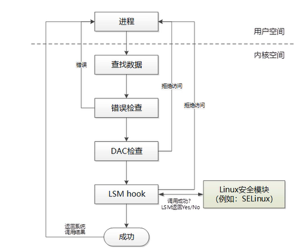
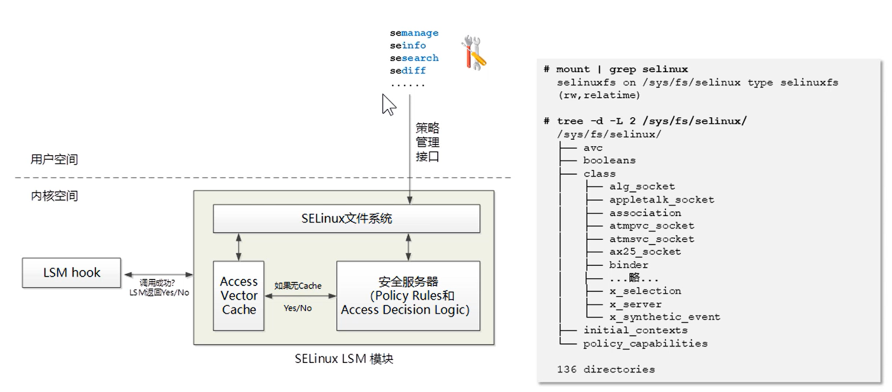
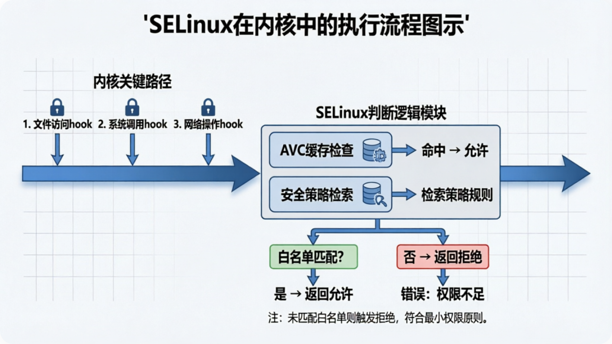
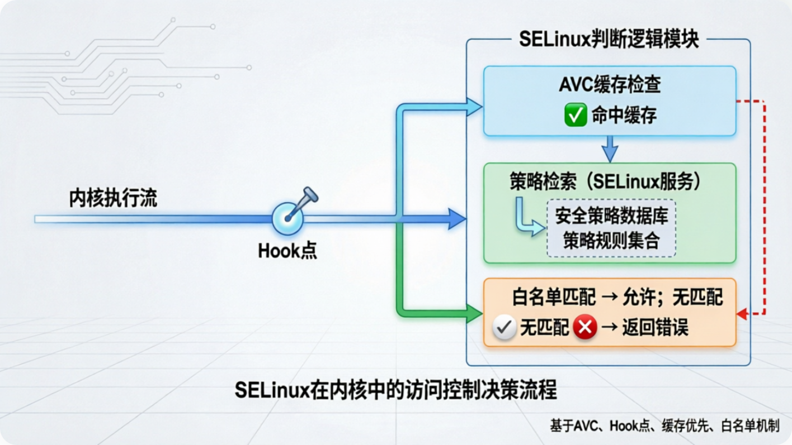
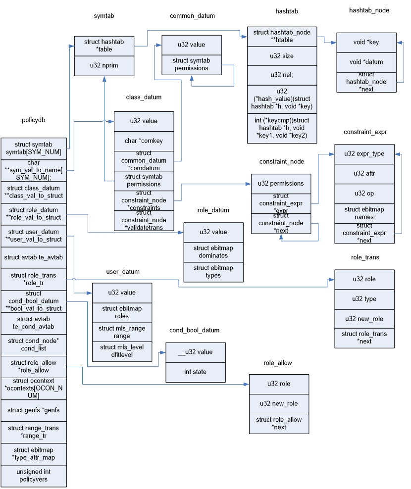
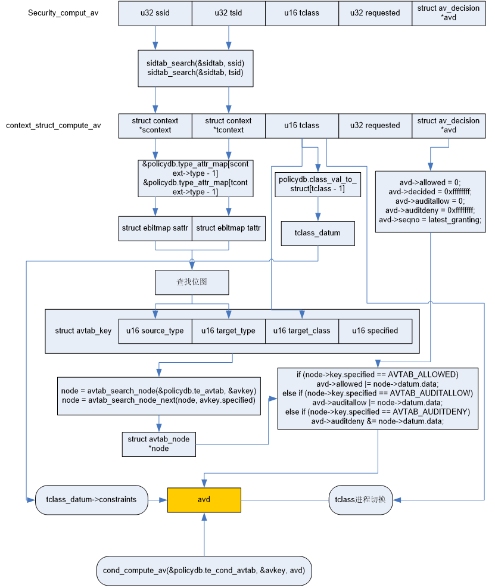

# SElinux源码分析


```text
Something I hope you know before go into the coding~
First, please watch or star this repo, I'll be more happy if you follow me.
Bug report, questions and discussion are welcome, you can post an issue or pull a request.
```

## 源码来源

基于OpenEuler内核，仓库地址 <https://  atomgit.com/openeuler/kernel>
分支：OLK-6.6

---

## 目录

* [LSM源码分析](docs/LSM源码分析/LSM源码分析.md)
* [强制访问控制](docs/强制访问控制/强制访问控制.md)
* [安全上下文](docs/安全上下文/安全上下文.md)
* [SELinux hook点分析](docs/SelinuxHook点分析/SelinuxHook点分析.md)
* [SE Linux核心数据结构](docs/SElinux核心数据结构/SElinux核心数据结构.md)
* [SE Linux基本原理](docs/SELinux基本原理/SELinux基本原理.md)
    * [TE类型增强](docs//SELinux基本原理/TE类型增强.md)
    * [RBAC](docs//SELinux基本原理/RBAC.md)
    * [MLS](docs//SELinux基本原理/MLS.md)
    * [MCS](docs//SELinux基本原理/MCS.md)
* [关键路径](docs/关键路径.md)
    * [入口与缓存查找](docs/关键路径/入口与缓存查找.md)
    * [安全服务器查找](docs/关键路径/安全服务器查找.md)
    * [te](docs/关键路径/te.md)
    * [mcs](docs/关键路径/mcs.md)
    * [mls](docs/关键路径/mls.md)
* [用户态工具](docs/用户态工具.md)
    * [libselinux](docs/用户态工具/libselinux/libselinux.md)
    * [policycoreutils](docs/用户态工具/policycoreutils/policycoreutils.md)
    * [policycoreutils-python-utils](docs/用户态工具/policycoreutils-python-utils/policycoreutils-python-utils.md)
    * [setools-console](docs/用户态工具/setools-console/setools-console.md)
    * [setroubleshoot-server](docs/用户态工具/setroubleshoot-server/setroubleshoot-server.md)
    * [policycoreutils-devel](docs/用户态工具/policycoreutils-devel/policycoreutils-devel.md)
    * [mcstrans](docs/用户态工具/mcstrans/mcstrans.md)
    * [audit](docs/用户态工具/audit/audit.md)
* [SELinux模块](docs/SELinux模块/SELinux模块.md)
* [实践用例](docs/实践用例/实践用例.md)
    * [01.httpd非默认站点无权限访问](docs/实践用例/httpd非默认站点无权限访问.md)
    * [02.httpd非默认端口无法监听](docs/实践用例/httpd非默认端口无法监听.md)
    * [03.数据目录迁移后无法访问](docs/实践用例/数据目录迁移后无法访问.md)
    * [04.crontab无法执行定时任务](docs/实践用例/crontab无法执行定时任务.md)
    * [05.容器无法挂载宿主机目录](docs/实践用例/容器无法挂载宿主机目录.md)


---

## 相关图示














---
