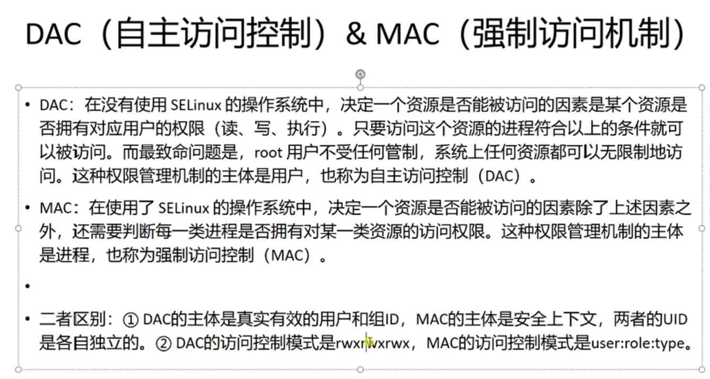
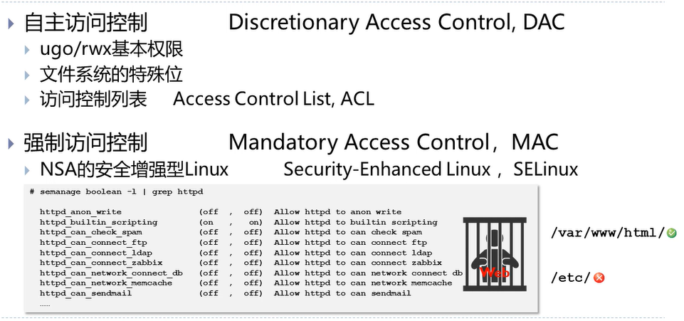
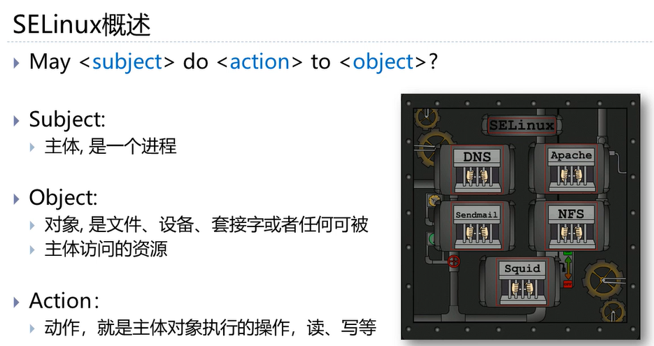

# 强制访问控制









在 Linux 系统中，权限管理通常分为两个层面：**自主访问控制**（DAC）和**强制访问控制**（MAC）。

虽然 DAC（即我们熟悉的 `rwx` 权限和用户组）能满足大部分需求，但在面对复杂的系统安全威胁时，它显得力不从心。MAC 的出现正是为了弥补这一短板，它提供了一种更强硬、更细粒度的安全机制，即使 root 用户也无法轻易绕过。

DAC

## 🛡️ 什么是强制访问控制 (MAC)？

**强制访问控制**（MAC）是一种由操作系统强制执行的访问控制策略。

- **自主访问控制 (DAC) 的局限：** 在传统的 Linux DAC 模型中，文件或资源的所有者（Owner）可以随意更改权限（例如 `chmod 777`），允许任何其他用户访问。如果一个以 `root` 身份运行的服务（如 Web 服务器）被黑客攻破，黑客就拥有了 `root` 的所有权限，可以读取系统中的任何文件。
- **MAC 的解决方案：** MAC 在 DAC 的基础上增加了一层安全策略。它不关心文件的“所有者”是谁，而是根据预定义的安全策略来决定进程能否访问特定的资源。
    - **核心逻辑：** 即使你是 root，或者你是文件所有者，如果安全策略没有明确允许你的操作，系统内核就会拒绝该请求。
    - **特点：** 策略是全局的、强制的，普通用户（甚至 root）无法随意修改策略。

## ⚙️ Linux 中的 MAC 实现机制

Linux 内核通过 **Linux 安全模块**（LSM）框架支持 MAC。LSM 是一个轻量级的接口，允许不同的安全模型加载到内核中。目前最主流的两种实现是：

### SELinux
- **全称：** Security-Enhanced Linux
- **背景：** 由美国国家安全局（NSA）开发，旨在展示在 Linux 中应用强制访问控制的可行性。
- **特点：**
    - **功能极强：** 提供了非常精细的控制粒度（基于类型强制）。
    - **复杂性高：** 配置和排错难度较大，学习曲线陡峭。
    - **主要用户：** Red Hat 系列（RHEL, CentOS, Fedora）。
- **工作原理：** 给每个进程和文件打上“安全上下文”标签，策略规则定义了什么标签的进程可以访问什么标签的文件。

### AppArmor
- **背景：** 最初由 Immunix 开发，后被 Novell 收购，现在由 Canonical（Ubuntu 的母公司）维护。
- **特点：**
    - **易用性强：** 配置相对简单，基于路径而非复杂的标签。
    - **主要用户：** SUSE 系列，Debian 系列（Ubuntu）。
- **工作原理：** 基于路径的访问控制。策略直接定义“程序 /path/to/app 可以读写哪些文件”。

## 🆚 SELinux 与 AppArmor 对比

| 特性 | SELinux | AppArmor |
| :--- | :--- | :--- |
| **控制粒度** | 极细（基于标签/属性） | 较细（基于路径） |
| **配置难度** | 高（需要理解复杂的上下文概念） | 低（配置文件类似 ACL，易读） |
| **默认发行版** | RHEL, CentOS, Fedora | Ubuntu, SUSE, Debian |
| **策略逻辑** | 默认拒绝（未明确允许的即禁止） | 支持“强制模式”（拒绝）和“抱怨模式”（仅记录） |
| **灵活性** | 极高，适合复杂的大型环境 | 适合快速部署和特定应用加固 |

## 💡 核心概念解析（以 SELinux 为例）

为了更好地理解 MAC，我们需要了解几个关键概念：

- **主体：** 通常是进程（如 `httpd` 进程）。
- **客体：** 资源（如文件、目录、端口、套接字）。
- **安全上下文：** 这是 MAC 的核心。每个主体和客体都关联了一个安全上下文标签。
    - 例如，Web 服务器的文件通常被标记为 `httpd_sys_content_t`。
    - 即使文件权限是 `777`，如果 `ssh` 进程试图读取标记为 `httpd_sys_content_t` 的文件，SELinux 策略可能会拒绝访问，因为 `ssh` 不应该读取 Web 内容。
- **策略：** 一组规则，定义了主体对客体的操作权限。

## 🛠️ 常用管理命令

在实际运维中，你可能需要检查 MAC 的状态或进行简单的管理。

### 检查状态
```bash
# 查看 SELinux 状态 (Enforcing: 强制, Permissive: 宽容/仅记录, Disabled: 关闭)
sestatus

# 查看 AppArmor 状态
sudo apparmor_status
```

### SELinux 常用操作
```bash
# 临时设置为宽容模式（不拦截，只记录违规，用于排错）
sudo setenforce 0

# 临时设置为强制模式（开启拦截）
sudo setenforce 1

# 查看文件的安全上下文
ls -Z filename

# 查看进程的安全上下文
ps -auxZ | grep process_name
```

### AppArmor 常用操作
```bash
# 禁用某个程序的配置
sudo ln -s /etc/apparmor.d/usr.bin.firefox /etc/apparmor.d/disable/

# 重新加载配置
sudo apparmor_parser -r /etc/apparmor.d/usr.bin.firefox
```

## 📌 总结

Linux 的强制访问控制（MAC）是系统安全的最后一道防线。

- **DAC** 决定了“用户”对“文件”的基本权限。
- **MAC (SELinux/AppArmor)** 决定了“进程”在系统中能做什么。

虽然配置 MAC 可能会增加管理的复杂度，但它能有效防止“权限提升”和“漏洞利用”，特别是在服务被攻破后，能将损失限制在最小范围内（例如，即使黑客攻破了 Nginx，由于 MAC 的限制，他也无法读取 `/etc/shadow` 文件）。