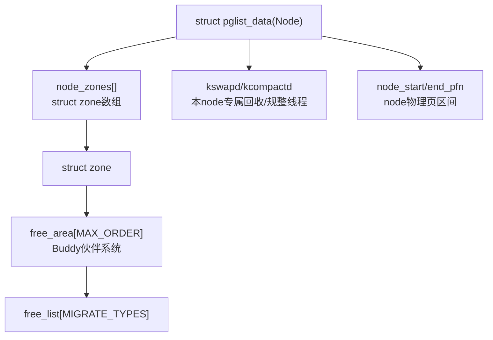

# node - 内存节点

```text
struct pglist_data  (Node 节点)
        │
        └── struct zone node_zones[]  (内存域)
                │
                └── struct free_area[MAX_ORDER]  (Buddy 伙伴系统)
                        │
                        └── 迁移类型链表 + nr_free 计数

```

```text

/*
 * On NUMA machines, each NUMA node would have a pg_data_t to describe
 * it's memory layout. On UMA machines there is a single pglist_data which
 * describes the whole memory.
 *
 * Memory statistics and page replacement data structures are maintained on a
 * per-zone basis.
 */
typedef struct pglist_data {
	/*
	 * node_zones contains just the zones for THIS node. Not all of the
	 * zones may be populated, but it is the full list. It is referenced by
	 * this node's node_zonelists as well as other node's node_zonelists.
	 */
	struct zone node_zones[MAX_NR_ZONES];

	/*
	 * node_zonelists contains references to all zones in all nodes.
	 * Generally the first zones will be references to this node's
	 * node_zones.
	 */
	struct zonelist node_zonelists[MAX_ZONELISTS];

	int nr_zones; /* number of populated zones in this node */
#ifdef CONFIG_FLATMEM	/* means !SPARSEMEM */
	struct page *node_mem_map;
#ifdef CONFIG_PAGE_EXTENSION
	struct page_ext *node_page_ext;
#endif
#endif
#if defined(CONFIG_MEMORY_HOTPLUG) || defined(CONFIG_DEFERRED_STRUCT_PAGE_INIT)
	/*
	 * Must be held any time you expect node_start_pfn,
	 * node_present_pages, node_spanned_pages or nr_zones to stay constant.
	 * Also synchronizes pgdat->first_deferred_pfn during deferred page
	 * init.
	 *
	 * pgdat_resize_lock() and pgdat_resize_unlock() are provided to
	 * manipulate node_size_lock without checking for CONFIG_MEMORY_HOTPLUG
	 * or CONFIG_DEFERRED_STRUCT_PAGE_INIT.
	 *
	 * Nests above zone->lock and zone->span_seqlock
	 */
	spinlock_t node_size_lock;
#endif
	unsigned long node_start_pfn;
	unsigned long node_present_pages; /* total number of physical pages */
	unsigned long node_spanned_pages; /* total size of physical page
					     range, including holes */
	int node_id;
	wait_queue_head_t kswapd_wait;
	wait_queue_head_t pfmemalloc_wait;

	/* workqueues for throttling reclaim for different reasons. */
	wait_queue_head_t reclaim_wait[NR_VMSCAN_THROTTLE];

	atomic_t nr_writeback_throttled;/* nr of writeback-throttled tasks */
	unsigned long nr_reclaim_start;	/* nr pages written while throttled
					 * when throttling started. */
#ifdef CONFIG_MEMORY_HOTPLUG
	struct mutex kswapd_lock;
#endif
	struct task_struct *kswapd;	/* Protected by kswapd_lock */
	int kswapd_order;
	enum zone_type kswapd_highest_zoneidx;

	int kswapd_failures;		/* Number of 'reclaimed == 0' runs */

#ifdef CONFIG_COMPACTION
	int kcompactd_max_order;
	enum zone_type kcompactd_highest_zoneidx;
	wait_queue_head_t kcompactd_wait;
	struct task_struct *kcompactd;
	bool proactive_compact_trigger;
#endif
	/*
	 * This is a per-node reserve of pages that are not available
	 * to userspace allocations.
	 */
	unsigned long		totalreserve_pages;

#ifdef CONFIG_NUMA
	/*
	 * node reclaim becomes active if more unmapped pages exist.
	 */
	unsigned long		min_unmapped_pages;
	unsigned long		min_slab_pages;
#endif /* CONFIG_NUMA */

	/* Write-intensive fields used by page reclaim */
	CACHELINE_PADDING(_pad1_);

#ifdef CONFIG_DEFERRED_STRUCT_PAGE_INIT
	/*
	 * If memory initialisation on large machines is deferred then this
	 * is the first PFN that needs to be initialised.
	 */
	unsigned long first_deferred_pfn;
#endif /* CONFIG_DEFERRED_STRUCT_PAGE_INIT */

#ifdef CONFIG_TRANSPARENT_HUGEPAGE
	struct deferred_split deferred_split_queue;
#endif

#ifdef CONFIG_NUMA_BALANCING
	/* start time in ms of current promote rate limit period */
	unsigned int nbp_rl_start;
	/* number of promote candidate pages at start time of current rate limit period */
	unsigned long nbp_rl_nr_cand;
	/* promote threshold in ms */
	unsigned int nbp_threshold;
	/* start time in ms of current promote threshold adjustment period */
	unsigned int nbp_th_start;
	/*
	 * number of promote candidate pages at start time of current promote
	 * threshold adjustment period
	 */
	unsigned long nbp_th_nr_cand;
#endif
	/* Fields commonly accessed by the page reclaim scanner */

	/*
	 * NOTE: THIS IS UNUSED IF MEMCG IS ENABLED.
	 *
	 * Use mem_cgroup_lruvec() to look up lruvecs.
	 */
	struct lruvec		__lruvec;

	unsigned long		flags;

#ifdef CONFIG_LRU_GEN
	/* kswap mm walk data */
	struct lru_gen_mm_walk mm_walk;
	/* lru_gen_folio list */
	struct lru_gen_memcg memcg_lru;
#endif

	CACHELINE_PADDING(_pad2_);

	KABI_RESERVE(1)
	KABI_RESERVE(2)
	KABI_RESERVE(3)

	/* Per-node vmstats */
	struct per_cpu_nodestat __percpu *per_cpu_nodestats;
	atomic_long_t		vm_stat[NR_VM_NODE_STAT_ITEMS];
#ifdef CONFIG_NUMA
	struct memory_tier __rcu *memtier;
#endif
#ifdef CONFIG_MEMORY_FAILURE
	struct memory_failure_stats mf_stats;
#endif
} pg_data_t;
```

# Linux NUMA Node（`struct pglist_data`）资深内核专家必备知识点清单
> 定位：**Node是Linux物理内存顶层管理单元，所有Zone、Buddy、页回收、NUMA调度、内存热插拔、页规整、CMA全部依附Node架构**，从源码、调度、内存管理、故障、调优、跨版本全维度梳理。

## 一、基础结构体与源码（必精通：`struct pglist_data / pgdat`）

### 1. struct pglist_data核心成员与含义
```c
struct pglist_data {
    struct zone node_zones[MAX_NR_ZONES]; // 当前node下属所有zone数组
    struct zone *node_zonelists[MAX_ZONELISTS]; // 备用zone降级分配链表(跨zone fallback)
    int nr_zones;                         // 当前node实际有效的zone个数
    unsigned long node_start_pfn;         // node起始物理页帧号PFN
    unsigned long node_end_pfn;           // node结束PFN
    unsigned long node_spanned_pages;     // 本node总物理页数(含空洞)
    unsigned long node_present_pages;     // 有效可用物理页数(剔除内存空洞)
    pg_data_t *pgdat_next;                // 全局node链表，串联所有NUMA节点
    wait_queue_head_t kswapd_wait;        // 本node专属kswapd回收线程等待队列
    wait_queue_head_t pfmemalloc_wait;
    struct task_struct *kswapd;           // 每个Node独立kswapd页回收内核线程
#ifdef CONFIG_COMPACTION
    struct task_struct *kcompactd;        // 每个Node独立kcompactd规整线程
#endif
    unsigned long totalreserve_pages;     // node预留总内存
    ...
};
```
**重点掌握字段：**
1. `node_zonelists`：**分配降级关键**，本node内存不足时，按优先级从其他node/zone借内存（ZONELIST_FALLBACK）；
2. `kswapd/kcompactd`：NUMA架构下**每个Node独立回收、规整线程**，UMA全局一个node一套；
3. PFN范围：区分`spanned/present`，理解物理内存空洞（E820预留、硬件空洞）。

### 2. Node编号与架构区分
1. **UMA架构(单CPU主板/嵌入式)**：只有`node0`，全局唯一pgdat；
2. **NUMA架构(多路Xeon/AMD服务器)**：多个node，每个node绑定一组CPU、一段直连物理内存；
3. `MAX_NUMNODES`编译配置、`numa_nodes`全局位图、node id管理；
4. 内存拓扑：CPU→node亲和、cpu_to_node()/node_to_cpumask()/pfn_to_nid()/page_to_nid()常用宏实现。

## 二、Node初始化全流程（从开机memblock→pgdat→zone→buddy）
1. **固件E820/设备树**上报物理内存布局，拆分各个node物理地址区间；
2. `setup_node_zones()`：按node划分PFN区间，逐个初始化`pglist_data`；
3. `free_area_init_node()`：单node内部zone初始化，依次初始化zone→free_area(buddy)；
4. memblock内存移交：boot空闲内存从memblock迁移到对应node的zone的buddy空闲链表；
5. 启动本node专属kswapd、kcompactd内核线程；
6. 内存空洞、预留内存(reserve)不纳入node可用内存统计。

> 关键：**Buddy是以Zone为粒度，但Zone归属Node，所有buddy空闲内存归属对应node统计**。

## 三、NUMA内存分配策略（重中之重，alloc_pages路径node控制）
### 1. 分配时Node选择规则
1. **优先本地node(LOCAL)**：依据当前运行CPU所属node（`numa_node_id()`），是默认策略；
2. `nodemask_t`：`alloc_pages_nodemask()`自定义node白名单（驱动/内核指定从某几个node分配）；
3. 本地node内存不足→`node_zonelists` fallback跨node降级分配，按内核配置的node优先级依次尝试；
4. gfp标记`__GFP_THISNODE`：强制只在指定node分配，失败直接返回NULL，不跨node借用。

### 2. zonelists分层
- ZONELIST_ZONE：优先本node内部zone；
- ZONELIST_FALLBACK：跨node备用zone链表，由内核根据NUMA拓扑构建。

### 3. sysctl NUMA调度参数
- `vm.numa_zonelist_order`：调整跨node fallback顺序；
- `numa_balancing`（自动NUMA均衡）：内核线程迁移页到访问CPU本地node，减少跨节点远端内存访问开销。

## 四、Node关联各大内核子系统（和buddy/kswapd/compaction/CMA/SLUB联动）
### 1. 与Buddy伙伴系统
1. 每个Zone归属唯一Node，Zone的free_area（buddy）所有空闲页统计计入所属node；
2. `/proc/pagetypeinfo`、`/proc/zoneinfo`按node→zone→order分层展示buddy空闲；
3. 内存热插拔新增内存：挂载到指定node→zone，加入对应buddy空闲链表。

### 2. 与页回收 kswapd
1. **一Node一kswapd**：kswapd只负责本node所有zone的页面回收，空闲低于zone水位触发本node kswapd；
2. node级总空闲不足：kswapd遍历本node所有zone回收页，回收页释放回本node对应zone的buddy；
3. min_free_kbytes是全局配置，内核会按node内存占比拆分到各node、各zone。

### 3. 与内存规整 compaction & kcompactd
1. **每个Node独立kcompactd线程**，异步规整本node内所有zone，为THP/CMA生成高阶buddy连续内存；
2. 直接规整（分配高阶内存失败）：优先在当前node内zone做内存迁移规整，失败才跨node。

### 4. 与CMA、HugePage、THP
1. CMA区域创建绑定指定node+zone，预留内存从对应node的buddy划出；
2. 静态大页HugePage：从指定node物理内存预留，脱离buddy管理；
3. THP透明大页优先从本地node高阶buddy分配，本地不足触发本node规整。

### 5. SLUB/SLOB内存池
SLUB缓存池按node独立缓存（NUMA节点本地slab池），kmalloc优先从当前node本地slab，slab缺页下沉到本node buddy申请物理页。

### 6. OOM机制
OOM判定**以node/全局**两种粒度：
- 开启`vm.oom_dump_tasks`：某node所有zone内存耗尽、跨node分配失败，触发OOM；
- cgroup内存限制绑定node，触发cgroup级OOM。

## 五、NUMA自动均衡：numa_balancing（Linux4.0+核心特性）
1. 原理：CPU频繁访问远端node内存时，内核后台迁移页面到CPU本地node，降低跨NUMA节点访存延迟（远端内存QPI/UPI总线延迟远高于本地）；
2. 触发：页缺页异常#PF，内核检测页面所在node != 当前CPU node，加入迁移队列；
3. 开关：`/proc/sys/vm/numa_balancing`，服务器性能优化高频调优点；
4. 副作用：频繁页迁移带来CPU开销，数据库/高性能场景常关闭。

## 六、内存热插拔（Node粒度上下线，企业运维/云内核必备）
1. **内存热插**：新增物理内存→划分对应node→初始化pgdat/zone→内存加入buddy空闲；
2. **内存热删(下线node)**：
    - 先迁移本node所有可移动(MOVABLE)页到其他node；
    - 回收RECLAIMABLE页，释放回buddy；
    - 无法迁移的UNMOVABLE页阻止node下线；
3. 相关配置：CONFIG_MEMORY_HOTPLUG / CONFIG_NUMA。

## 七、调试、查看、性能定位手段
### 1. 用户态查看
1. `numactl --hardware`：查看node数量、每个node内存大小、node间距离；
2. `/proc/zoneinfo`：按node→zone展示空闲页、buddy各阶统计、水位；
3. `/proc/numa_balancing_stats`：NUMA均衡迁移统计；
4. `numastat`：各node命中/失效、跨node分配次数（性能排查核心）。

### 2. 内核调试(crash/gdb)
1. `pgdat_list`全局链表遍历所有node；
2. `node_zones`查看单个node下属zone；
3. 统计各node总空闲buddy页数，定位内存泄漏、碎片。

### 3. tracepoint
trace_alloc_pages/trace_free_pages过滤nid，追踪内存在哪一个node分配释放。

## 八、碎片化&性能调优（专家落地能力）
1. **跨node分配过多性能劣化**：通过numastat定位应用进程绑定错误CPU/node，使用numactl --cpunodebind/membind绑定进程到指定node；
2. node内高阶buddy碎片：调整kcompactd参数、ZONE_MOVABLE比例、CMA大小；
3. 原子分配失败：MIGRATE_HIGHATOMIC按node预留原子内存；
4. 数据库场景：关闭numa_balancing、禁用THP、进程独占node。

## 九、跨内核版本演进差异
1. Linux2.6早期：NUMA简陋，无独立kcompactd、无numa_balancing，kswapd全局；
2. Linux3.x：完善zonelist、node独立kswapd、compaction落地；
3. Linux4.x：numa_balancing正式合入内核、kcompactd per node；
4. Linux5.x~6.x：NUMA规整优化、稀疏内存sparse架构增强、内存热插拔优化。

## 十、特殊内存架构拓展
1. **SPARSEMEM稀疏内存模型**：现代服务器默认，每个node内存分段管理，适配内存空洞、热插拔；对比FLATMEM平坦内存（老式UMA）；
2. 嵌入式ARM：大多UMA单node，部分ARM64高端平台支持NUMA多node；
3. 大页/巨型页GB级：绑定指定node物理内存。

## 补充：Node → Zone → Buddy 结构体Mermaid（精简版）


需要我把这份知识点整理成**文档版**，或者拆分「面试考点精简版」吗？