# 腾讯BT调度算法

## 官方介绍

### 特性简介

一种适用于离线业务的全新调度算法。使用了该算法的离线业务，对在线业务的运行几乎没有影响，可以有效提升系统的CPU利用率。

### 研发背景

目前互联网企业都拥有海量的服务器，其中大部分只运行交互类延时敏感的在线业务，使CPU利用率非常低，造成资源的浪费（据统计全球服务器CPU利用率不足20%）。为提高服务器CPU的利用率，需要在运行在线业务的服务器上，混合部署一些高CPU消耗且延时不敏感的离线业务。然而，现有的实现在混部后在线业务的服务质量下降严重，甚至无法进行混部。所以需要一种针对离线业务的新的调度算法。

### 业界现有方案对比

目前业界通用的混部方案在离在线业务使用的调度算法这一层是没有区别的，都是CFS算法，只是使用cgroup进行彼此隔离，然后使用cpu子系统的shares和quota机制来控制离在线业务CPU的使用限制。这种方案同样可以提升CPU利用率，但离线业务的运行会影响在线业务的服务质量，尤其是时延非常敏感的在线业务。所以应用场景有限，不具备普适性。 另外，内核提供了SCHED_BATCH和SCHED_IDLE两种优先级比较低的调度算法，但它们仍然和CFS共用相同的实现，尤其是在负载均衡时是未做区分的，它们是没有完全的和CFS隔离开来，所以效果上面介绍的通用方案存在类似的问题。

### 设计原理

业界现有混部方案无法普遍适用，问题就在离在线业务在调度算法这一层次没有做区分，造成：如果离线业务在运行时，在线业务到来无法及时的抢占CPU；再者，在做负载均衡时，无法区分离在线业务，造成在线业务挤占相同的CPU，无法均匀合理的分散到所有所有CPU上。 为此，好的混部方案就是将离在线业务彻底分开，所以在调度算法这一层次就要做区分。基于这种考虑，开发了针对离线业务的新调度算法bt，该算法可以保证在线业务优先运行。新调度算法的基本算法借鉴于CFS，但在CPU选择、抢占、负载均衡、时延处理、CPU带宽控制等多个方面都有自己的特点和要求，有特有的处理方式。特别是配有特有的负载均衡策略、CPU带宽控制策略等。 整个的运行机制如下图:

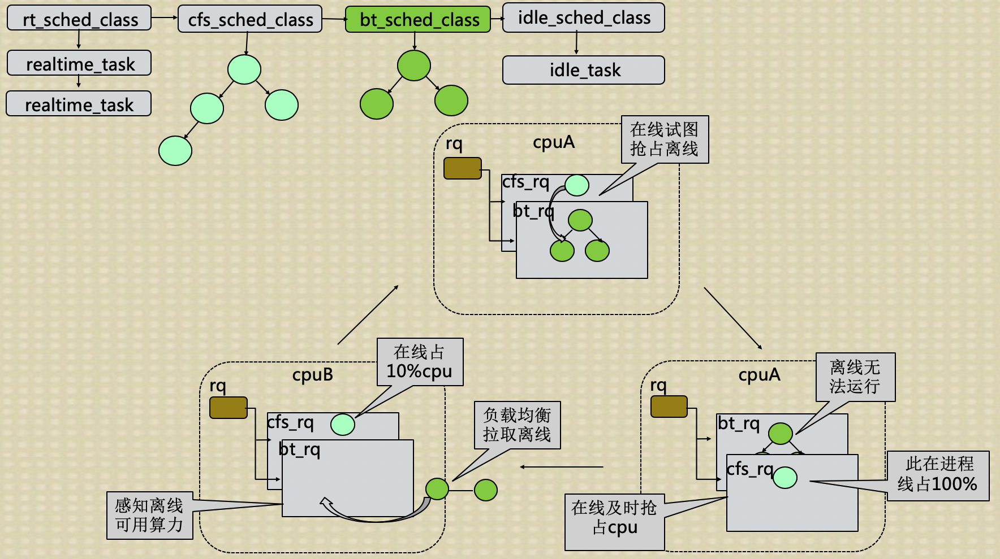

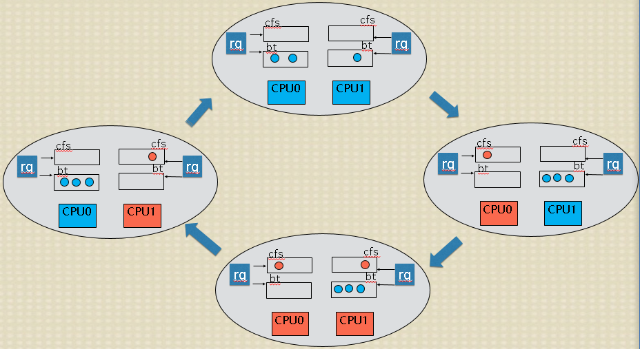

其中：蓝色代表使用新离线调度算法bt的离线业务；橙色代表在线业务；CPU的颜色代表哪种业务在运行。通过运行切换图可以看到：1、只有离线业务时，如同CFS一样可以均匀的分散到CPU上；2、在线业务需要运行时，可以及时的抢占离线业务占用的CPU，且将离线业务排挤到其它离线业务占用的CPU上，这样在线业务及时得到运行且离线也会占用剩余CPU，存在个别离线业务无法运行的情况；3、在线业务较多时，可以均衡合理的占用所有CPU，此时离线业务抢不到CPU；4、在线业务休眠时，离线业务可以及时的占用在线业务释放的CPU。

### 业务场景效果
目前混部方案的效果腾讯各BG多种业务场景下得到了验证，功能满足业务需求，在不影响在线业务的前提下，整机cpu利用率提升非常显著，超过业务预期。下面列举几个业务场景：

场景A 如下图所示，在A测试场景中，模块a一个用于统计频率的模块，对时延非常敏感。此业务不能混部，整机CPU利用率只有15%左右，业务尝试过使用cgroup方案来混部，但是cgroup方案混部之后，对在线模块a影响太大，导致错误次数陡增，因此此模块一直不能混部。使用我们提供的方案之后，可以发现，CPU提升至60%，并且错误次数基本没有变化。

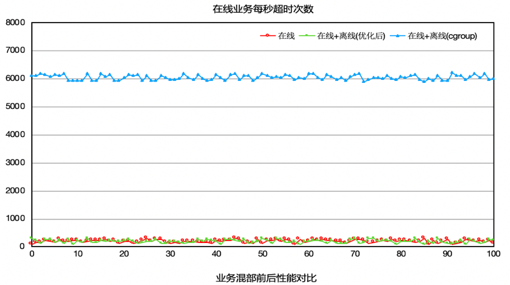

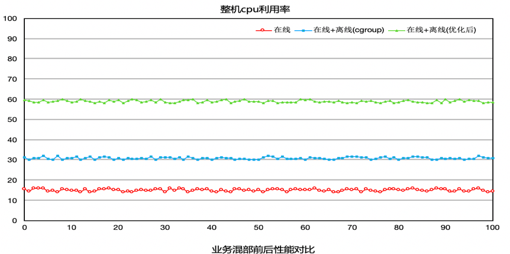

场景B 在B测试场景中（模块b是一个翻译模块，对时延很敏感），原本b模块是不能混部的，业务尝试过混部，但是因为离线混部上去之后对模块b的影响很大，时延变长，所以一直不能混部。使用我们的方案的效果如下图所示，整机CPU利用率从20%提升至50%，并且对模块没有影响，时延基本上没有变化

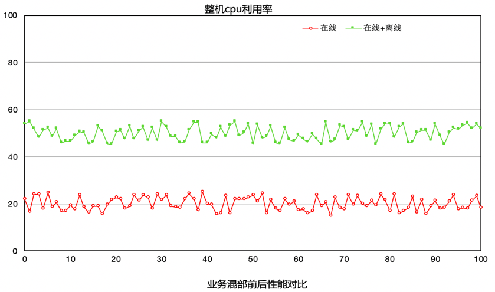

场景C 模块C对时延不像场景A，B那么敏感，所以在使用我们提供的方案之前，利用cgroup方案进行混部，CPU最高可以达到40%。但是平台不再敢往上压，因为再往上压就会影响到在线c业务。如下图所示，使用我们的方案之后，平台不断往机器上添加离线业务，将机器CPU压至90%的情况下，c业务的各项指标还是正常，并没有受到影响。

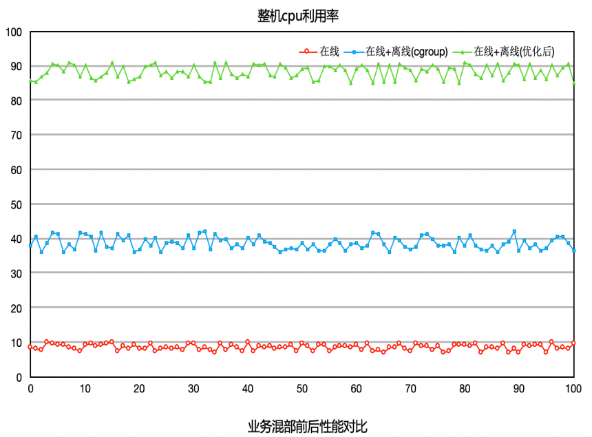

上面列的是腾讯内部使用BT调度算法的效果。有兴趣的同学可以在自己的业务场景中进行适用，真实的去体验腾讯离在线混部方案的效果。具体使用方法详见下面的使用指南。

### 使用方法
我们提供了一个启动参数offline_class来支持用户程序使用离线调度。 设置offline_class即使能了离线调度，用户可以通过sched_setscheduler函数把一个进程设置成离线调度：

其中7表示离线调度。 设置成功后，我们可以用top比较下设置前后进程的优先级变化， 设置前： 

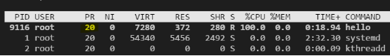

设置成离线调度后：

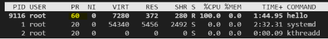

通过设置kernel.sched_bt_period_us和kernel.sched_bt_runtime_us这两个内核参数，我们可以控制离线进程占用的cpu比例。 默认情况下kernel.sched_bt_period_us=1000000，kernel.sched_bt_runtime_us=-1，表示控制周期是1s，离线进程占用cpu不受限制，比如，我们设置kernel.sched_bt_runtime_us=100000，即离线占用10%的cpu：

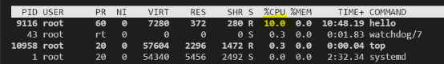

统计离线进程所占cpu比例 通过查看/proc/bt_stat文件，可以查看系统中离线进程所占用的cpu比例：

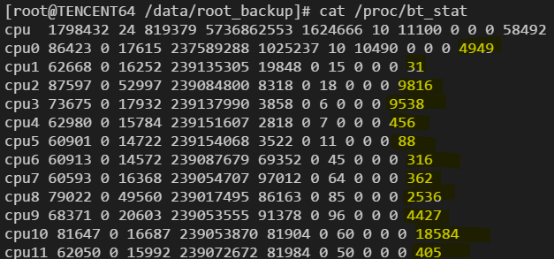

该文件的结构和/proc/stat类似，只是在每个cpu的最后又增加了一列，表示该cpu上离线进程运行的时间。

离线调度对docker的支持 在docker中使用离线调度，我们可以同上面讲的一样，调用sched_setscheduler将docker中的进程设置为离线，或者在启动容器时，将容器的1号进程设置成离线，这样容器内再启动的其他进程也自动是离线的。

为了更好的支持docker，离线调度在cgroup的cpu目录下会新增几个和离线调度相关的文件：

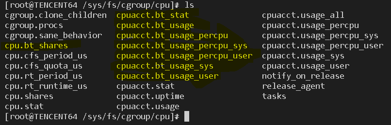

cpu.bt_shares：同cpu.shares，表示该task group的share比例。 cpuacct.bt_stat,cpuacct.bt_usage,cpuacct.bt_usage_percpu_sys, cpuacct.bt_usage_percpu_user,cpuacct.bt_usage_sys,cpuacct.bt_usage_user同cfs的相应文件一样，只不过统计的是该task group中的离线进程数据。

## 目录

